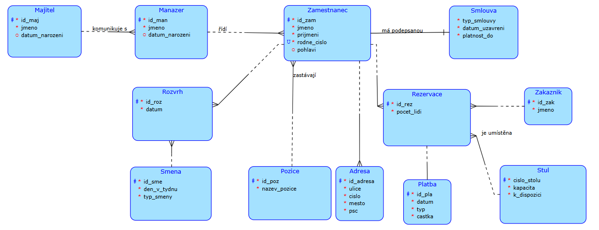

# Database Systems Course Project - Restaurant system (PostgreSQL)
Normalized relational schema, seed data, and a set of non-trivial SQL queries for a restaurant reservation domain.

**Note on the schema**
- The base in DDL in `dbs-course-project/sql/create.generated.sql` was **exported from the university portal** (auto-generated).
- I added my own SQL (queries and optional integrity tweaks).

All data in **synthetic** and the original course documentation is in **Czech**; this README is the **English summary**.

---

## Highlights
- Relational design with PK/FK and constraints (DDL/DML)
- 24 SQL queries: joins, GROUP BY/HAVING, set operations, subqueries, division pattern
- One **transaction** demo (BEGIN/COMMIT/ROLLBACK)

## ER diagram

